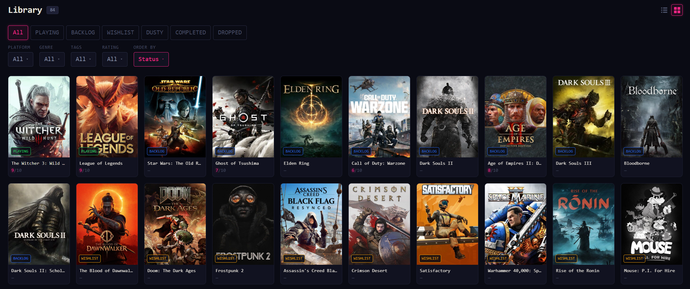

# The Game Cellar — Frontend

> React 19 single-page app for The Game Cellar. Dashboard, library, recommendations, explore, wildcard, game detail, profile. Strict-mode TypeScript end-to-end, server state via TanStack Query, DTOs auto-generated from each backend service's OpenAPI spec.


**Port:** `5173`



## Tech Stack

- **TypeScript 5.9** — `strict: true`. Every page, component, hook, and service typed end-to-end against backend DTOs.
- **React 19** — functional components and hooks only. No class components.
- **Vite 8** — dev server on port 5173, production build via `vite build`.
- **Tailwind CSS v4** — utility-first, `@import "tailwindcss"` in `index.css`. No config file.
- **Axios** — HTTP client with a 401-refresh interceptor and typed retry queue.
- **React Router v6** — client-side routing.
- **TanStack Query v5** — server-state layer. `useQuery` for reads, `useMutation` for writes. Hierarchical query-key factories co-located with each service module.
- **OpenAPI-generated types** — `openapi-typescript@7` regenerates `src/types/api/{game,library,recommendation}.ts` from each backend service's `/v3/api-docs`. Backend DTO changes surface as compile errors on the next typecheck.
- **Vitest + MSW + Testing Library** — 19 test files / 45 tests covering services, context, components, mutation invalidation, and one smoke test per page.

## Routes

| Route                     | Protected | Description                                                                                            |
|---------------------------|-----------|--------------------------------------------------------------------------------------------------------|
| `/login`                  | No        | Login form.                                                                                            |
| `/register`               | No        | Custom registration form. Calls `/api/v1/auth/register`.                                               |
| `/callback`               | No        | OAuth callback (PKCE). Exchanges authorization code for tokens, then navigates to `/onboarding`.       |
| `/onboarding`             | No        | Platform selection (required) + optional genre / tag / release-year preferences.                       |
| `/dashboard`              | Yes       | Recommendations, "Because you liked" seed, Wild Card, Coming Soon, DUSTY strip, backlog snapshot.      |
| `/library`                | Yes       | Game collection. Status tabs, platform / genre / tags / rating filters, list + grid view toggle.       |
| `/recommendations`        | Yes       | Personalized recommendations grid, grouped by genre row.                                               |
| `/explore`                | Yes       | Browse the catalog. Search, genre / platform filters, "Coming soon" view.                              |
| `/wildcard`               | Yes       | Dedicated Wild Card discovery page with a Roll Again button.                                           |
| `/games/:igdbId`          | Yes       | Game detail. Hero, Add / Change status, `RatingWidget`, similar games scroll, addons.                  |
| `/profile`                | Yes       | Account: email, change email / password, export data, delete account, sign out.                        |
| `/profile/statistics`     | Yes       | Library overview, average rating, games by genre + platform.                                           |
| `/profile/preferences`    | Yes       | Platforms + declared genre / tag / release-year preferences.                                           |

## Service Layer

All API calls go through the **API Gateway on port 8000**. No direct calls to backend services. The 401-refresh interceptor in `services/api.ts` calls `/auth/refresh` and replays the original request on the new access cookie.

Each service module pairs a Axios-facing functions with a TanStack Query layer:

| Service                | Key factory          | Read hooks                                                                                                                                       | Write hooks                                                                                              |
|------------------------|----------------------|--------------------------------------------------------------------------------------------------------------------------------------------------|----------------------------------------------------------------------------------------------------------|
| `gameService`          | `gameKeys`           | `useSearchGames`, `useGameById`, `usePopularGames`, `useUpcomingGames`, `useGenres`, `useGamePlatforms`, `usePopularTags`, ...                    | none                                                                                                     |
| `libraryService`       | `libraryKeys`        | `useUserGames`, `useBacklog`, `useWishlist`, `usePlaying`, `useCompleted`, `useStats`, `useDustyGames`, `useGenrePreferences`, `useTagPreferences`| `useAddGame`, `useUpdateGame`, `useRemoveGame`, `useAddPlatform`, `useUpdateGenrePreferences`, ...       |
| `recommendationService`| `recommendationKeys` | `useDashboard`, `usePersonalizedGrouped`, `useWildCard`, `useSimilar`, `useBasedOn`                                                               | none                                                                                                     |
| `authService`          | —                    | —                                                                                                                                                | `useLogin`, `useRegister`, `useExchangeAuthorizationCode`, `useChangeEmail`, `useChangePassword`, ...    |

Library write mutations invalidate both `libraryKeys.all` and `recommendationKeys.all`. Logout and `deleteAccount` call `queryClient.clear()` on the singleton in `src/services/queryClient.ts`.

## Auth

The app uses **direct Keycloak REST** rather than the Keycloak JS adapter. JWT is parsed manually without an external library. Tokens live in HttpOnly cookies set by the API Gateway, never readable from JavaScript.

`AuthProvider` bootstraps identity from `GET /api/v1/auth/me` with a refresh-token fallback. `useAuth()` returns `{ isAuthenticated, isLoading, userId, email, roles, login, logout }` and throws if used outside the provider.

Full auth flow lives in the [`api-gateway` README](https://github.com/The-Game-Cellar/api-gateway#readme).

## File Structure

```
frontend/
├── openapi/                          Captured backend OpenAPI specs (committed)
│   ├── game-service.json
│   ├── library-service.json
│   └── recommendation-service.json
└── src/
    ├── types/api/                    Auto-generated from openapi/*.json
    │   ├── game.ts
    │   ├── library.ts
    │   ├── recommendation.ts
    │   └── index.ts                  Stable re-export surface
    ├── pages/                        Route-level components
    ├── components/{common,library,game}/
    ├── services/                     Axios + TanStack Query
    ├── context/{AuthContext,AuthProvider}.tsx
    ├── hooks/
    ├── config/
    ├── test/                         Vitest + MSW
    ├── App.tsx
    └── main.tsx
```

## Type Generation

DTOs are not hand-written. After any backend DTO change:

```bash
npm run types:gen
```

This pulls `/v3/api-docs` from each service (`api-gateway`, `game-service`, `library-service`, `recommendation-service`) into `openapi/*.json` and regenerates `src/types/api/{game,library,recommendation}.ts`. Type-check after to catch breakage:

```bash
npm run typecheck
```

## Run Locally

### Prerequisites

- Node 22+
- A running API Gateway on port 8000 (and the rest of the backend, since the app fans out to it)

### Dev server

```bash
npm install
npm run dev
```

App boots at <http://localhost:5173>. Vite proxies API calls to whatever `VITE_API_URL` resolves to (default `http://localhost:8000`).

### Production build

```bash
npm run build
npm run preview      # optional: serve the production bundle locally
```

`VITE_*` values are baked into the bundle at build time. Changing one requires a fresh `vite build`.

## Tests

```bash
npm test             # vitest run
npm run test:watch   # vitest watch mode
```

19 test files / 45 tests cover:

- One smoke test per route (renders without crashing under MSW handlers).
- Service modules (axios client, retry queue, query-key factories).
- `AuthContext` bootstrap and refresh flow.
- Mutation invalidation (library writes invalidate both library + recommendation caches).
- Common components.

MSW default handlers in `src/test/handlers.ts` cover auth, library, games, and recommendations.

## Configuration

Only `VITE_*`-prefixed values are exposed to the browser bundle.

| Variable                                 | Default                  | Purpose                                                  |
|------------------------------------------|--------------------------|----------------------------------------------------------|
| `VITE_API_URL`                           | `http://localhost:8000`  | API Gateway base URL                                     |
| `VITE_KEYCLOAK_URL`                      | `http://localhost:8080`  | Keycloak base URL                                        |
| `VITE_KEYCLOAK_REALM`                    | `game-cellar`            | Realm name                                               |
| `VITE_KEYCLOAK_CLIENT_ID`                | `game-cellar-client`     | Client ID                                                |
| `VITE_LOGIN_TRANSITION_MIN_MS`           | `700`                    | First-ever-login ceremony floor (ms)                     |
| `VITE_LOGIN_TRANSITION_MIN_MS_REPEAT`    | `200`                    | Repeat-login floor (ms)                                  |
| `VITE_LOGIN_TRANSITION_MAX_MS`           | `1500`                   | Hard cap on the login transition                         |

Anything in `VITE_*` ships in the browser bundle. **Do not put secrets here.**

## Design

Dark, dense, terminal-leaning. Background `#0a0b14`, surface `#111220`, neon accent `#f72585` always paired with a glow shadow. Monospace stack anchored on Fira Code.

## License

[MIT](./LICENSE)
